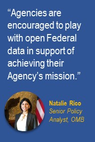
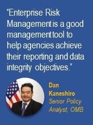
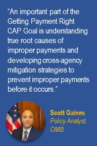
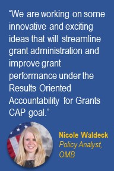
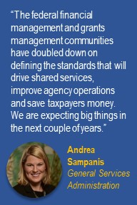

<section class="usa-section-takeaways">
<h2 style="text-align:center;">3 Key Takeaways</h2>
<ol>
<li>By using emerging 21st century technology and capabilities, federal, state, and local financial management is evolving to better serve American taxpayers by improving the service, mission, and stewardship of federal agencies.</li>
<li>The ultimate success of federal financial management relies on the three key drivers of reform set forth by the President’s Management Agenda:  modern information technology; data, accountability and transparency; and workforce for the 21st century.</li>
<li>Cross-Agency Priority Goals do not operate in silos. A group of several Cross-Agency Priority Goals are working in unison to advance federal financial management.</li>
</ol>
</section>

The federal government collects more than $3 trillion in tax revenues every year. Americans entrust the government and its employees to use their tax dollars in the best interest of the country and the needs of its people. This makes efficient and effective financial management a vital part of how federal agencies’ serve the American people and protect taxpayers’ interests. Advances in technology and business strategies offer new opportunities for agencies to modernize their approach to federal financial management and maximize the value Americans get from their tax dollars.  This opportunity for transformation is captured in the <a href="../PMA/PMA.html">President’s Management Agenda</a> and the Cross-Agency Priority (CAP) Goals.

Federal financial management experts, including policymakers from the White House Office of Management and Budget (OMB), recently convened at the Association of Government Accountants Professional Development Training conference to share how cross-agency efforts, driven by the CAP goals, are driving innovation and improvement of federal financial management.

<h2><a href="../CAP/CAP_goal_2.html">CAP Goal: Leveraging Data as a Strategic Asset</a></h2>

<b><u>Overview:</u></b> This CAP goal aims to leverage data as a strategic asset to grow the economy, increase the effectiveness of the Federal Government, facilitate oversight, and promote transparency. As the federal government finds ways to better gather and use data, it has tremendous potential for a more sophisticated approach to managing finances. Integrating data-driven decision-making into organizational culture is an important step in achieving these advances. According to Natalie Rico, Senior Policy Analyst at OMB, financial managers can promote a data-driven culture by leveraging investments made in recent laws like the DATA Act and Administration priorities like <a href="../CAP/CAP_goal_10.html">Technology Business Management (TBM)</a>. OMB recently published an update to Appendix A of Circular A-123 titled: Management of Reporting and Data Integrity Risk.  The updated guidance gives agencies maximum flexibility to adopt a risk-based approach towards improving overall data quality, enable agencies to leverage data as a strategic asset for accomplishing their missions, and providing greater transparency to the public via <a href="https://www.usaspending.gov/" target="_blank">USASpending.gov.</a>

<b><u>CAP goal in Action:</u></b> As agencies pivot their focus from primarily on reporting federal data to using federal data to inform decision-making they can build upon prior work performed in the areas of internal control and financial reporting.  Agencies can use enterprise risk management (ERM) to help identify reporting and data integrity risks and develop risk management strategies, including formal internal controls.  In response to the update to Appendix A of A-123, an interagency working group to develop implementation guidance to support agencies in managing their reporting and data integrity risk.
  

In addition to data use, federal agencies are focused on improving mission delivery. Under <a href="https://opportunity.census.gov/" target="_blank">The Opportunity Project (TOP)</a> agencies can leverage partnerships with the tech industry to create digital tools that address our greatest challenges as a nation.

For this sprint, OMB and the Department of Treasury partnered with a joint problem statement to improve the accessibility and management of Federal grants, and advance government accountability with Federal <a href="https://www.usaspending.gov/" target="_blank">spending</a>  and performance data.

<h2><a href="../CAP/CAP_goal_9.html">CAP Goal: Getting Payments Right</a></h2>

<b><u>Overview:</u></b> Getting payments right is an integral part of effective and efficient federal financial management. The goal of the Getting Payments Right CAP Goal is to prevent improper payments that result in monetary loss by giving agencies the tools and resources they need to identify, resolve, and mitigate improper payments before they happen. This renewed emphasis on prevention is designed to strategically target monetary loss. Progress will be shown on <a href="https://paymentaccuracy.gov/" target="_blank">Paymentaccuracy.gov</a>.

In June, OMB published <a href="https://www.whitehouse.gov/wp-content/uploads/2018/06/M-18-20.pdf" target="_blank">Payment Integrity Improvement</a> guidance to transform the improper payment compliance framework and create a more meaningful, unified, and comprehensive set of requirements for the federal government. OMB is helping agencies leverage disruptive technology to promote data sharing, improve recipient authentication, and build stakeholder collaboration. These efforts have already made a significant and meaningful difference in the way agencies approach improper payments.

<b><u>CAP goal in Action:</u></b> As part of the Getting Payments Right CAP Goal, an Improper Payment Working Group was established to design and build workable solutions to some of the federal government’s most complex payment integrity issues. Led by representatives from the Department of the Treasury, the Department of Health and Human Services, and OMB, the working group has led the effort to reduce cash loss, clarify and streamline guidance, and improve federal partnerships with individual states. Recommendations from this group will help agencies improve their payment-related integrity efforts by leveraging expertise across the government and building the capacity of key stakeholders to make a significant difference in the number of improper payments made each year.

<h2><a href="../CAP/CAP_goal_8.html">CAP Goal: Results Oriented Accountability for Grants</a></h2>

<b><u>Overview:</u></b> The federal government is standardizing grants reporting and data collection in order to better serve the American taxpayer. The CAP goal aims to maximize the value of grant funding by applying a risk-based, data-driven framework that balances compliance requirements with demonstrating successful results for the American taxpayer.

<b><u>CAP goal in Action:</u></b> Led by the Department of Education, Department of Health and Human Services, and OMB, the CAP goal focuses on standardizing data, leveraging existing data sources and processes, developing a risk-management framework and diving into risk-based performance management. One key element of this work is the Uniform Guidance, which provides a government-wide framework for grants management. We can leverage the Uniform Guidance to align with the work of the Results-Oriented Accountability for Grants CAP goal. The grants community is encouraged to get involved and stay informed. Join the new grants <a href="https://digital.gov/communities/results-oriented-accountability-for-grants/" target="_blank">community of practice</a> CAP Goal 8 listserv for more information. Specific efforts are targeted at preventing fraud in federal assistance programs. State agencies, federal grantors, and state prosecutors all have a role in preventing fraud.

<h2><a href="../CAP/CAP_goal_10.html">CAP Goal: Improving Outcomes Through Federal IT Spending Transparency</a></h2>

<b><u>Overview:</u></b> The Federal Government spends at least $90 billion annually on IT. Federal executives know that with better visibility and more accurate data, they can better manage that spending. This CAP goal improves IT spending data accountability and transparency and empowers agency executive-suite leadership to drive innovation, business transformation and mission value. The FY 2018 President’s Budget reported 84% of the total Federal IT budget categorized as “other,” as opposed to being clearly tied to a specific IT category of spend. This means that federal executives, and American taxpayers, do not have the visibility they need into technology investments and their impacts.

<b><u>CAP goal in Action:</u></b> One way federal executives are addressing this challenge is through a method called Technology Business Management (TBM), an open source standard for IT costs that Chief Information Officers (CIOs) and Chief Financial Officers (CFOs) use to run IT like a business. With TBM, agencies can improve services to citizens and increase accountability to taxpayers by driving innovation and cost transparency. To work towards this mission, agencies will be required to submit individualized plans to explain how they will meet the deadline of adopting government-wide standards and implement Technology Business Management in a common way across the Federal enterprise.

<h2><a href="../CAP/CAP_goal_5.html">CAP Goal: Sharing Quality Services</a></h2>

<b><u>Overview:</u></b> The current approach to performing common administrative services in government (human resources, financial management, procurement, travel, and grants management) has resulted in massive duplication, fragmentation, and manual processes. For example, the federal government currently has more than 40 financial management systems and more than 1,900 separate contracts for financial management support. The absence of common business processes, insufficient investment funding, inconsistent delivery, and aging technology prevent economies of scale and take valuable time, energy and resources away from agency missions.

The 10-year vision for streamlining administrative services laid out in the CAP goal will help agencies tackle these issues. Across government the transformation will drive cost efficiencies by leveraging common practices, maintaining fewer systems and consolidating and modernizing technology.

Andrea Sampanis emphasized the role that governance and standards will play the success of this initiative and the progress the financial management community has made to date through the <a href="https://www.ussm.gov/fibf/" target="_blank">Federal Integrated Business Framework</a>.

<h2><a href="../CAP/CAP_goal_6.html">CAP Goal: Shifting from Low-Value to High-Value Work</a></h2>

Alongside all of these CAP goal efforts, the Shifting from Low-Value to High-Value Work CAP Goal is promoting a streamlined and efficient approach. With this goal, the federal government is removing and replacing outdated and unnecessary policies that create unproductive burdens for federal agencies. This allows agencies to shift time, effort, and funding from burdensome requirements to work that promotes better financial management and use of taxpayer dollars. Through the President’s Management Agenda, this administration has already identified more than 400 time-wasting plans and reports that could be eliminated tomorrow and free up tens of thousands of work hours. GSA’s CFO Office is using process automation and other reforms to target more than 50,000 annualized hours and shift them to higher-value mission work performed by employees.

In support of the PMA, and to help achieve the goals of M-17-26, Reducing Burden for Federal Agencies by Rescinding and Modifying OMB Memoranda, OMB updated Appendix A of A-123, Management of Reporting and Data Integrity Risk.  Grounded in the PMA, the updated guidance provides agencies the discretion needed to leverage Enterprise Risk Management, to take a risk-based approach to identify areas of control activity to pull back from and focus on higher value and better return on investment. The update also eliminated over 100+ pages of burden and obsolete, overly prescriptive guidance to agencies while superseding previous OMB guidance that may have provided a confusing foundation for audit criteria externally.

